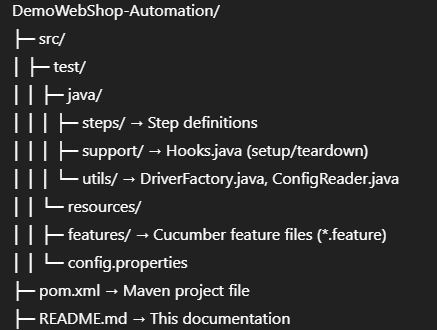
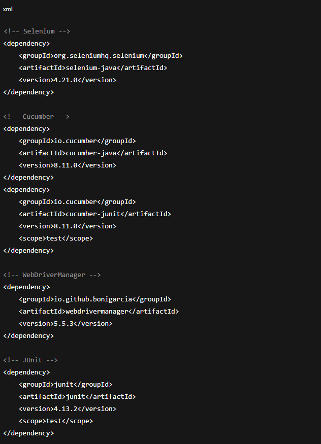

# DemoWebShop Automation Framework

[](https://www.oracle.com/java/)
[](https://www.selenium.dev/)
[](https://cucumber.io/)
[](https://maven.apache.org/)
[](#)

---

## Project Overview

This framework automates testing for [DemoWebShop](https://demowebshop.tricentis.com/) using:

- **Selenium WebDriver** for browser automation
- **Cucumber BDD** for readable feature files and step definitions
- **Java** programming language
- **Maven** for dependency management
- **JUnit** as test runner
- **WebDriverManager** for automatic browser driver management

The framework is designed to be:

- Modular (Steps, Hooks, Utilities)
- Configurable via `config.properties`
- Capable of generating **HTML & JSON reports**
- Supports **tagged execution** (e.g., `@smoke`, `@regression`)
- Runs **single browser session per test suite**

---

## Project Structure


├─ README.md → This documentation


---

## Prerequisites

- Java JDK 11+ installed and `JAVA_HOME` set
- Maven installed and `MAVEN_HOME` set
- Supported browsers installed: Chrome, Firefox, Edge

---

## Configuration

Edit `src/test/resources/config.properties`:

```properties
browser=chrome
baseUrl=https://demowebshop.tricentis.com/
implicitWait=10
explicitWait=10

```
- browser → chrome | firefox | edge
- baseUrl → URL of the application under test


You can override the browser from the command line:

## Running Tests
### Run from IDE
- Right-click TestRunner.java → Run as JUnit Test
### Run from Maven


#### Running Tagged Scenarios examples
+ Run only @smoke tests:
``` mvn test -Dcucumber.filter.tags="@smoke" ```
+ Run @smoke AND @critical:
  ``` mvn test -Dcucumber.filter.tags="@smoke and @critical" ```
+ Run only @smoke tests:
    ``` mvn test -Dcucumber.filter.tags="@smoke or @regression" ```
+ Run only @smoke tests:
    ``` mvn test -Dcucumber.filter.tags="not @wip" ```

## Reports
+ HTML report → target/cucumber-report.html+ 
+ JSON report → target/cucumber.json
+ Screenshots → captured automatically for failed scenarios

## Reports
#### DriverFactory
+ Creates single WebDriver instance
+ Supports Chrome, Firefox, Edge
+ Maximizes browser window

#### ConfigReader
+ Reads properties from config.properties
+ Centralizes configuration

#### Hooks
+ @BeforeAll → Browser setup
+ @After → Screenshot on failure
+ @AfterAll → Browser teardown

## Feature Files & Steps
Feature files: src/test/resources/features/*.feature

+ Step definitions: src/test/java/steps/*.java
+ Supports actions like: Click links, Enter text in input fields, Click Continue / Register buttons, 
Verify messages

## Dependencies
--- <!-- Selenium -->
---


## GitLab CI/CD Integration
The project is integrated with GitLab CI/CD using the .gitlab-ci.yml file in the project root.


### Pipeline Overview
+ Stage: test
+ Browser: Configurable via BROWSER variable
+ Headless Mode: Chrome runs headless in CI/CD environment
+ Artifacts: HTML and JSON reports, screenshots

#### Pipeline Variables

Variable	        Default	Description
- BROWSER	chrome	    Browser for Selenium tests
- BASE_URL: https://demowebshop.tricentis.com/  Base URL of the web application

#### Triggering Pipeline

Commit and push changes:

```
+ git add .
+ git commit -m "Implement new test steps"
+ git push origin main

```
GitLab automatically triggers the pipeline.


#### Running Specific Tests in Pipeline
Example: run only smoke tests:

```
script:
  - mvn clean test -Dbrowser=$BROWSER -Dcucumber.options="--tags @smok
```

#### Artifacts and Reports
After pipeline execution, GitLab stores artifacts:
+ target/cucumber-report.html → HTML report
+ target/cucumber.json → JSON report
+ target/screenshots/ → Screenshots of failed tests

Reports can be downloaded from GitLab pipeline UI.

## Contributing
+ Fork the repository
+ Create a feature branch:
```
git checkout -b feature/your-feature
```

Commit your changes:
```
git add .
git commit -m "Add new step definition"
```

## Optional: Docker Execution
Build Docker image:
```
docker build -t demowebshop-automation .
```

Run container:
```
docker run --rm -v $(pwd)/target:/usr/src/app/target demowebshop-automation
```

All reports and screenshots will be stored in target/ folder.